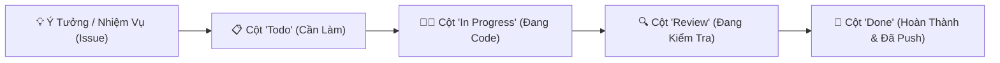

# 🚀 GitHub Toàn Tập - Từ Cơ Bản Đến Làm Chủ (GitHub Zero To Hero Mastery Guide)

<p align="center">
  <a href="README.md"><b>🇻🇳 Tiếng Việt</b></a> &nbsp;|&nbsp; 
  <a href="README_EN.md"><b>🇺🇸 English</b></a>
</p>

<p align="center">
  
  <a href="https://dungautomation-dev.github.io/github-mastery-guide/"></a>
  
  
  
</p>

<p align="center">
  🌐 <strong>Khám phá phiên bản sách tương tác & mô phỏng nhánh trực quan tại:</strong><br>
  👉 <a href="https://dungautomation-dev.github.io/github-mastery-guide/"><strong>https://dungautomation-dev.github.io/github-mastery-guide/</strong></a>
</p>

<p align="center">
  <strong>Cẩm nang đầy đủ, trực quan và chi tiết nhất về Git & GitHub: Giải mã mọi tính năng, tối ưu hóa thao tác, làm chủ quản lý dự án với Projects, và danh mục các liên kết thao tác nhanh.</strong>
</p>

---

## 📑 Mục Lục Chi Tiết

- [1. Giải Mã Tính Năng "Projects" Trên GitHub Là Gì?](#1-giải-mã-tính-năng-projects-trên-github-là-gì)
  - [Bản chất của GitHub Projects](#bản-chất-của-github-projects)
  - [So sánh: Projects vs Issues vs Repositories](#so-sánh-projects-vs-issues-vs-repositories)
  - [Các chế độ hiển thị mạnh mẽ (Board, Table, Roadmap)](#các-chế-độ-hiển-thị-mạnh-mẽ)
  - [Hướng dẫn 3 bước tạo Project đầu tiên](#hướng-dẫn-3-bước-tạo-project-đầu-tiên)
- [2. Phân Biệt Giữa Git và GitHub](#2-phân-biệt-giữa-git-và-github)
- [3. Bản Đồ Giao Diện GitHub (Ecosystem Navigation)](#3-bản-đồ-giao-diện-github-ecosystem-navigation)
- [4. Lộ Trình Học Git/GitHub: Từ Cơ Bản Đến Chuyên Sâu](#4-lộ-trình-học-gitgithub-từ-cơ-bản-đến-chuyên-sâu)
  - [Cấp độ 1: Khởi đầu & Bộ 5 lệnh cơ bản](#cấp-độ-1-khởi-đầu--bộ-5-lệnh-cơ-bản)
  - [Cấp độ 2: Quản lý nhánh (Branch) & Gộp code (Merge)](#cấp-độ-2-quản-lý-nhánh-branch--gộp-code-merge)
  - [Cấp độ 3: Quy trình Pull Request (PR) & Review chuẩn công ty](#cấp-độ-3-quy-trình-pull-request-pr--review-chuẩn-công-ty)
  - [Cấp độ 4: Tự động hóa CI/CD với GitHub Actions](#cấp-độ-4-tự-động-hóa-cicd-với-github-actions)
- [5. Tuyệt Chiêu Tối Ưu Thao Tác & Phím Tắt Ma Thuật](#5-tuyệt-chiêu-tối-ưu-thao-tác--phím-tắt-ma-thuật)
  - [Phím tắt ma thuật trên trình duyệt web](#phím-tắt-ma-thuật-trên-trình-duyệt-web)
  - [Cài đặt Git Aliases tăng tốc độ gõ lệnh x5 lần](#cài-đặt-git-aliases-tăng-tốc-độ-gõ-lệnh-x5-lần)
  - [Mở code bằng VS Code Web trong 1 giây](#mở-code-bằng-vs-code-web-trong-1-giây)
- [6. Danh Mục Liên Kết Thao Tác Trực Tiếp (Direct Links Directory)](#6-danh-mục-liên-kết-thao-tác-trực-tiếp-direct-links-directory)
- [7. Cỗ Máy Thời Gian: Kỹ Thuật Lùi Về Bất Kỳ Phiên Bản Nào (Time Travel)](#7-cỗ-máy-thời-gian-kỹ-thuật-lùi-về-bất-kỳ-phiên-bản-nào-time-travel)
- [8. Các Công Cụ GUI Cho Người Mới (Không Cần Gõ Lệnh)](#8-các-công-cụ-gui-cho-người-mới-không-cần-gõ-lệnh)

---

## 1. Giải Mã Tính Năng "Projects" Trên GitHub Là Gì?

Khi vào trang cá nhân GitHub của bạn (ví dụ: `https://github.com/Dungautomation-dev`), bạn sẽ thấy tab **`Projects`** nằm ngay cạnh `Repositories`.

### Bản chất của GitHub Projects
**GitHub Projects** (còn gọi là *Projects v2*) là công cụ **quản lý dự án, theo dõi tiến độ công việc và lập kế hoạch phát triển phần mềm** được GitHub tích hợp sẵn, có chức năng tương tự như **Trello, Jira hay Notion**.

Thay vì chỉ lưu trữ code đơn thuần, Projects giúp bạn trả lời các câu hỏi:
- *Dự án này đang có những tính năng nào cần làm?*
- *Việc nào đang làm (`In Progress`), việc nào đã xong (`Done`), việc nào đang bị lỗi?*
- *Kế hoạch phát hành phiên bản tiếp theo ra sao?*



---

### So sánh: Projects vs Issues vs Repositories

| Thành phần | Vai trò thực tế | Ví dụ dễ hiểu |
| :--- | :--- | :--- |
| **Repository (Kho code)** | Nơi chứa mã nguồn, thư mục, file thực tế | Giống như một **thư mục dự án** trên máy tính |
| **Issue (Vấn đề / Task)** | Mô tả một lỗi cụ thể cần sửa hoặc tính năng mới cần viết | Giống như một **tờ giấy ghi chú việc cần làm** |
| **Projects (Bảng dự án)** | Bảng điều phối tổng thể gom tất cả Issues lại để quản lý tiến độ | Giống như một **bảng trắng dán các tờ giấy ghi chú** |

---

### Các chế độ hiển thị mạnh mẽ

1. **Board (Bảng Kanban)**: Các thẻ công việc được kéo thả trực quan giữa các cột: `Todo` ➡️ `In Progress` ➡️ `Done`.
2. **Table (Bảng dữ liệu kiểu Excel/Notion)**: Xem danh sách công việc dưới dạng bảng có các cột: Tiêu đề, Người phụ trách (*Assignee*), Độ ưu tiên (*Priority: High, Medium, Low*), Trạng thái (*Status*).
3. **Roadmap (Biểu đồ tiến độ Gantt)**: Hiển thị mốc thời gian bắt đầu và kết thúc của từng tính năng trên dòng thời gian.

---

### Hướng dẫn 3 bước tạo Project đầu tiên

1. Nhấp trực tiếp vào liên kết: [**Tạo Project Mới Trên GitHub**](https://github.com/new/project)
2. Đặt tên Project (ví dụ: `Kế Hoạch Nâng Cấp Automation 2026`), chọn giao diện mẫu: **Board** (Khuyên dùng cho người mới).
3. Bấm **Create project**. Bây giờ bạn có thể bấm **+ Add item** để thêm các đầu việc cần làm và kéo thả chúng như trên Trello!

---

## 2. Phân Biệt Giữa Git và GitHub

Rất nhiều người mới lập trình thường nhầm lẫn Git và GitHub là một:

- **Git** là một **phần mềm mã nguồn mở chạy ngầm trên máy tính của bạn**. Nhiệm vụ của Git là ghi lại lịch sử từng dòng code bạn thay đổi (Version Control). Bạn có thể dùng Git hoàn toàn offline mà không cần kết nối mạng.
- **GitHub** là một **dịch vụ máy chủ đám mây** (thuộc tập đoàn Microsoft). GitHub là nơi bạn tải (push) các bản ghi lịch sử của Git từ máy tính lên mạng để sao lưu, chia sẻ cho người khác xem hoặc cùng làm việc nhóm.

```text
[ Máy tính của bạn ]                      [ Đám mây GitHub ]
   file code 
      ⬇️ (git commit)
   Lịch sử lưu trên máy  ========(git push)=======>  Kho chứa trực tuyến (GitHub Repo)
```

---

## 3. Bản Đồ Giao Diện GitHub (Ecosystem Navigation)

Khi truy cập vào một Repository trên GitHub, đây là ý nghĩa của từng thanh công cụ:

| Tab | Tên tiếng Việt | Tác dụng chính |
| :--- | :--- | :--- |
| **Code** | Mã nguồn | Xem cấu trúc thư mục, đọc code, tải file zip, lấy link clone |
| **Issues** | Vấn đề & Góp ý | Nơi báo lỗi, yêu cầu thêm tính năng, thảo luận kỹ thuật |
| **Pull Requests (PR)** | Yêu cầu gộp code | Nơi bạn xin người khác gộp code nhánh của bạn vào nhánh chính |
| **Actions** | Tự động hóa CI/CD | Chạy kịch bản tự động test, tự động đóng gói file `.exe`, auto build web |
| **Projects** | Quản lý dự án | Bảng Kanban theo dõi công việc của riêng repository này |
| **Wiki** | Bách khoa thư | Nơi viết sách hướng dẫn sử dụng chuyên sâu cho dự án |
| **Security** | Trung tâm an ninh | Cảnh báo lỗ hổng bảo mật của các thư viện, quét rò rỉ token |
| **Insights** | Thống kê | Xem ai đóng góp nhiều nhất, tần suất commit, số lượt xem repo |
| **Settings** | Cài đặt | Đổi tên repo, phân quyền cộng tác viên, bật GitHub Pages, xóa repo |

---

## 4. Lộ Trình Học Git/GitHub: Từ Cơ Bản Đến Chuyên Sâu

### Cấp độ 1: Khởi đầu & Bộ 5 lệnh cơ bản

Mọi thao tác hàng ngày với Git thực tế chỉ xoay quanh **5 câu lệnh thần thánh** sau:

```bash
# 1. Tải dự án từ GitHub về máy
git clone https://github.com/Dungautomation-dev/github-mastery-guide.git

# 2. Kiểm tra xem mình vừa sửa những file nào
git status -s

# 3. Chuẩn bị lưu tất cả các file đã sửa
git add .

# 4. Lưu lại mốc lịch sử kèm lời ghi chú rõ ràng
git commit -m "feat: cap nhat giao dien moi"

# 5. Đẩy code từ máy lên GitHub
git push origin main
```

---

### Cấp độ 2: Quản lý nhánh (Branch) & Gộp code (Merge)

> ⚠️ **Quy tắc vàng của lập trình viên chuyên nghiệp**: *Không bao giờ code thẳng tính năng mới vào nhánh `main`!* Nhánh `main` chỉ chứa code đã hoàn thiện và ổn định.

```bash
# Tạo và chuyển sang nhánh mới để làm tính năng đăng nhập
git checkout -b feature/login

# Code xong, lưu lại
git add .
git commit -m "feat: hoàn thành form đăng nhập"

# Chuyển về nhánh chính
git checkout main

# Gộp code từ nhánh tính năng vào nhánh chính
git merge feature/login

# Đẩy code mới lên GitHub
git push origin main
```

---

### Cấp độ 3: Quy trình Pull Request (PR) & Review chuẩn công ty

Khi làm việc nhóm trong doanh nghiệp, bạn không được tự ý `merge` code vào nhánh chính. Quy trình chuẩn sẽ là:

1. Bạn tạo nhánh `feature/xxx` và push nhánh đó lên GitHub (`git push origin feature/xxx`).
2. Lên GitHub bấm nút **"Compare & pull request"**.
3. Điền giải thích những gì bạn đã làm, gắn thẻ đồng nghiệp hoặc trưởng nhóm vào mục **Reviewers**.
4. Trưởng nhóm vào xem từng dòng code khác nhau (*Diff*), nếu đồng ý sẽ bấm **Approve** và **Merge pull request**.

---

### Cấp độ 4: Tự động hóa CI/CD với GitHub Actions

GitHub Actions cho phép bạn thiết lập các kịch bản tự động chạy trên máy chủ ảo của GitHub mỗi khi bạn `git push`. Ví dụ:
- Tự động kiểm tra cú pháp và chạy bài kiểm tra code (Unit Test).
- Tự động đóng gói phần mềm và tạo file cài đặt trên trang **Releases**.
- Tự động xuất bản trang web lên **GitHub Pages**.

Tất cả các kịch bản này được lưu dưới dạng file `.github/workflows/main.yml`.

---

## 5. Tuyệt Chiêu Tối Ưu Thao Tác & Phím Tắt Ma Thuật

### Phím tắt ma thuật trên trình duyệt web

Khi đang xem bất kỳ repository nào trên trang web GitHub:

| Phím tắt | Tác dụng ma thuật |
| :---: | :--- |
| **`.` (Dấu chấm)** | **Mở ngay trình soạn thảo Visual Studio Code trực tuyến** ngay trong trình duyệt! Bạn có thể sửa code và commit trực tiếp mà không cần cài đặt gì. |
| **`t`** | Bật thanh tìm kiếm file thần tốc (*Quick File Finder*), gõ tên file là nhảy tới ngay lập tức. |
| **`b`** | Bật chế độ xem **Git Blame** để xem chính xác ai đã viết từng dòng code và commit vào ngày nào. |
| **`y`** | Tự động tạo **Permalink cố định** của dòng code để gửi link cho bạn bè mà không bao giờ bị lỗi khi file bị sửa đổi sau này. |
| **`w`** | Bật menu chuyển nhanh qua lại giữa các nhánh (*Branches / Tags*). |
| **`/`** | Nhảy nhanh con trỏ lên thanh tìm kiếm toàn bộ kho code. |

---

### Cài đặt Git Aliases tăng tốc độ gõ lệnh x5 lần

Thay vì phải gõ dài dòng `git status`, `git commit -m`, bạn có thể gõ rút gọn `git s`, `git c`.

Dự án này đã đính kèm sẵn script cài đặt tự động trong thư mục `scripts/`:

👉 **Dành cho Windows (PowerShell)**:
```powershell
./scripts/git-setup-aliases.ps1
```

👉 **Dành cho macOS / Linux (Terminal)**:
```bash
chmod +x ./scripts/git-setup-aliases.sh
./scripts/git-setup-aliases.sh
```

---

### Mở code bằng VS Code Web trong 1 giây

Chỉ cần đổi tên miền trên thanh địa chỉ trình duyệt:
- Từ: `https://github.com/Dungautomation-dev/github-mastery-guide`
- Đổi chữ `github.com` thành `github.dev`: ➡️ `https://github.dev/Dungautomation-dev/github-mastery-guide`
- Hoặc đổi thành `github1s.com`: ➡️ `https://github1s.com/Dungautomation-dev/github-mastery-guide`

Toàn bộ kho code sẽ được nạp vào giao diện Visual Studio Code với đầy đủ cây thư mục, tô màu cú pháp và tìm kiếm cực nhanh!

---

## 6. Danh Mục Liên Kết Thao Tác Trực Tiếp (Direct Links Directory)

Dưới đây là danh sách các đường link truy cập nhanh vào từng trang tính năng quan trọng trên tài khoản GitHub của bạn:

| Thao tác muốn thực hiện | Liên kết trực tiếp trên GitHub |
| :--- | :--- |
| 🆕 **Tạo Repository mới** | [github.com/new](https://github.com/new) |
| 📋 **Quản lý / Tạo Project mới** | [github.com/new/project](https://github.com/new/project) hoặc [github.com/users/Dungautomation-dev/projects](https://github.com/users/Dungautomation-dev/projects) |
| 🔑 **Tạo Personal Access Token (Classic)** | [github.com/settings/tokens](https://github.com/settings/tokens) |
| 🔒 **Tạo Fine-grained Access Token** | [github.com/settings/personal-access-tokens/new](https://github.com/settings/personal-access-tokens/new) |
| 💻 **Cài đặt khóa SSH Keys** | [github.com/settings/keys](https://github.com/settings/keys) |
| 👤 **Chỉnh sửa hồ sơ cá nhân (Profile)** | [github.com/settings/profile](https://github.com/settings/profile) |
| 🔔 **Quản lý thông báo (Notifications)** | [github.com/notifications](https://github.com/notifications) |
| 🧩 **Chợ tiện ích GitHub Marketplace (Actions/Apps)** | [github.com/marketplace](https://github.com/marketplace) |
| 📝 **Tạo đoạn code chia sẻ nhanh (Gist)** | [gist.github.com](https://gist.github.com) |
| 🛡️ **Cài đặt bảo mật 2 lớp (2FA)** | [github.com/settings/security](https://github.com/settings/security) |
| 🌐 **Tài liệu chính thức của GitHub (Docs)** | [docs.github.com](https://docs.github.com) |

---

## 7. Cỗ Máy Thời Gian: Kỹ Thuật Lùi Về Bất Kỳ Phiên Bản Nào (Time Travel)

Một trong những sức mạnh cốt lõi của Git là khả năng **quay ngược cỗ máy thời gian** về bất kỳ phiên bản nào bạn từng commit trong quá khứ:

### 1. Chỉ muốn xem lại và chạy thử quá khứ (Không đổi hiện tại)
```bash
# Đưa toàn bộ file về trạng thái của commit cũ (Detached HEAD)
git checkout a1b2c3d
# Hoặc Git hiện đại:
git switch --detach a1b2c3d

# Quay lại hiện tại sau khi xem xong:
git switch main
```

### 2. Hoàn tác an toàn khi làm việc nhóm (Khuyên dùng)
```bash
# Tạo commit mới để đảo ngược lại commit lỗi mà không xóa lịch sử
git revert a1b2c3d
```

### 3. Hủy bỏ commit khi làm việc cá nhân
```bash
# Lùi 1 commit, giữ nguyên code đã sửa trong Staging
git reset --soft HEAD~1

# Lùi 1 commit, xóa sạch toàn bộ code sửa đổi (cẩn thận!)
git reset --hard HEAD~1
```

### 4. Hộp đen máy bay cứu sinh: `git reflog`
Nếu bạn lỡ tay chạy `git reset --hard` làm mất commit quan trọng, hãy gõ:
```bash
git reflog
# Tìm mã hash của commit bị mất và hồi sinh:
git reset --hard HEAD@{1}
```

---

## 8. Các Công Cụ GUI Cho Người Mới (Không Cần Gõ Lệnh)

Nếu bạn không quen sử dụng màn hình dòng lệnh màu đen (*Terminal*), hãy dùng các phần mềm giao diện đồ họa trực quan sau:

1. **[GitHub Desktop](https://desktop.github.com/)** *(Khuyên dùng)*:
   - Phần mềm chính chủ miễn phí 100% của GitHub.
   - Giao diện kéo thả, bấm nút Commit và Push chỉ với 1 click chuột.
2. **[GitLens (Extension trên VS Code)](https://marketplace.visualstudio.com/items?itemName=eamodio.gitlens)**:
   - Hiển thị ai đã viết từng dòng code ngay trong trình soạn thảo, hỗ trợ so sánh file trực quan.
3. **[GitKraken](https://www.gitkraken.com/)**:
   - Biểu đồ cây nhánh cực đẹp và chuyên nghiệp, kéo thả nhánh để merge code.

---

## 👨‍💻 Tác Giả & Giấy Phép

- **Tác giả**: [Dũng Automation](https://github.com/Dungautomation-dev)
- **Email**: dungautomation@gmail.com
- **Giấy phép**: Phát hành miễn phí theo giấy phép [MIT License](LICENSE).

<p align="center">
  🚀 <em>Chúc bạn chinh phục trọn vẹn Git & GitHub và tạo nên những sản phẩm công nghệ tuyệt vời!</em> ✨
</p>
