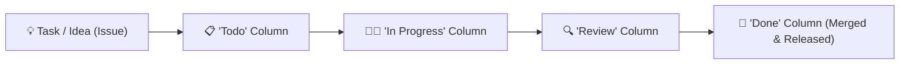

# 🚀 The Ultimate Git & GitHub Mastery Guide - Zero to Hero

<p align="center">
  <a href="README.md"><b>🇻🇳 Tiếng Việt</b></a> &nbsp;|&nbsp; 
  <a href="README_EN.md"><b>🇺🇸 English</b></a>
</p>

<p align="center">
  
  <a href="https://dungautomation-dev.github.io/github-mastery-guide/"></a>
  
  
  
</p>

<p align="center">
  🌐 <strong>Explore the interactive handbook and live visualizer at:</strong><br>
  👉 <a href="https://dungautomation-dev.github.io/github-mastery-guide/"><strong>https://dungautomation-dev.github.io/github-mastery-guide/</strong></a>
</p>

<p align="center">
  <strong>The most comprehensive and intuitive guide to mastering Git & GitHub: Demystifying features, project management with GitHub Projects, productivity shortcuts, and quick direct action links.</strong>
</p>

---

## 📑 Table of Contents

- [1. Demystifying "GitHub Projects" — What is it?](#1-demystifying-github-projects--what-is-it)
  - [The core essence of GitHub Projects](#the-core-essence-of-github-projects)
  - [Comparison: Projects vs. Issues vs. Repositories](#comparison-projects-vs-issues-vs-repositories)
  - [Powerful View Modes (Board, Table, Roadmap)](#powerful-view-modes-board-table-roadmap)
  - [3 Simple Steps to Create Your First Project](#3-simple-steps-to-create-your-first-project)
- [2. The Real Difference Between Git and GitHub](#2-the-real-difference-between-git-and-github)
- [3. GitHub Ecosystem Navigation Map](#3-github-ecosystem-navigation-map)
- [4. The Complete Learning Path: Zero to Hero](#4-the-complete-learning-path-zero-to-hero)
  - [Level 1: Fundamentals & The Essential 5 Commands](#level-1-fundamentals--the-essential-5-commands)
  - [Level 2: Branching & Merging Strategies](#level-2-branching--merging-strategies)
  - [Level 3: Pull Requests (PR) & Enterprise Code Reviews](#level-3-pull-requests-pr--enterprise-code-reviews)
  - [Level 4: CI/CD Automation with GitHub Actions](#level-4-cicd-automation-with-github-actions)
- [5. Productivity Superpowers & Magic Web Shortcuts](#5-productivity-superpowers--magic-web-shortcuts)
  - [Browser keyboard shortcuts](#browser-keyboard-shortcuts)
  - [Git Aliases for 5x typing speed](#git-aliases-for-5x-typing-speed)
  - [Instant VS Code Web editor in 1 second](#instant-vs-code-web-editor-in-1-second)
- [6. Direct Action Links Directory](#6-direct-action-links-directory)
- [7. The Git Time Machine: Rolling Back to Any Previous Version](#7-the-git-time-machine-rolling-back-to-any-previous-version)
- [8. Recommended GUI Clients for Beginners](#8-recommended-gui-clients-for-beginners)

---

## 1. Demystifying "GitHub Projects" — What is it?

When visiting your GitHub profile (e.g., `https://github.com/Dungautomation-dev`), you will see the **`Projects`** tab placed right beside `Repositories`.

### The core essence of GitHub Projects
**GitHub Projects** (also known as *Projects v2*) is an integrated **project management, task tracking, and software roadmapping tool** built natively into GitHub, functioning similarly to **Trello, Jira, or Notion**.

Rather than solely storing code files, Projects empowers you to track work:
- *What features are queued in the backlog?*
- *Which tasks are currently `In Progress`, `Under Review`, or `Done`?*
- *Who is responsible for what, and what are the release milestones?*



---

### Comparison: Projects vs. Issues vs. Repositories

| Component | Real-World Role | Intuitive Analogy |
| :--- | :--- | :--- |
| **Repository** | Stores source code, directories, git history | A **project folder** on your computer |
| **Issue** | Describes a specific bug or feature request | A **sticky note / task card** |
| **Projects** | Central coordination board tracking all issues | A **whiteboard** organizing all sticky notes |

---

### Powerful View Modes (Board, Table, Roadmap)

1. **Board (Kanban)**: Drag-and-drop task cards visually between status columns (`Todo` ➡️ `In Progress` ➡️ `Done`).
2. **Table (Spreadsheet / Notion style)**: View issues in rows with customizable columns: Title, Assignees, Priority, Milestone, Status.
3. **Roadmap (Gantt Chart)**: Visualize timeline dates, start dates, and delivery deadlines across sprints.

---

### 3 Simple Steps to Create Your First Project

1. Click directly on this link: [**Create New GitHub Project**](https://github.com/new/project)
2. Enter a project title (e.g., `Automation Roadmap 2026`), choose a template: **Board** (recommended).
3. Click **Create project**. Now you can click **+ Add item** to add tasks and drag-and-drop them effortlessly!

---

## 2. The Real Difference Between Git and GitHub

Beginners frequently confuse Git with GitHub:

- **Git** is an **open-source version control software running locally on your computer**. It tracks revisions line by line. Git functions completely offline without any internet connection.
- **GitHub** is a **cloud-based hosting platform** owned by Microsoft. It is where you upload (`git push`) your local Git history to backup, collaborate with teams, open pull requests, and deploy applications.

---

## 3. GitHub Ecosystem Navigation Map

| Tab | Meaning | Core Purpose |
| :--- | :--- | :--- |
| **Code** | Source Tree | Browse files, clone repository, download archives |
| **Issues** | Bug & Task Tracker | Report bugs, propose features, track discussions |
| **Pull Requests** | Code Merge Requests | Propose, review, discuss, and merge code changes |
| **Actions** | CI/CD Automation | Run automated tests, build deployment binaries, publish pages |
| **Projects** | Project Management | Kanban board coordinating tasks across repositories |
| **Wiki** | Documentation | Long-form documentation and architecture guides |
| **Security** | Security Center | Vulnerability alerts, secret scanning, Dependabot upgrades |
| **Settings** | Configuration | Manage repository name, access control, GitHub Pages |

---

## 4. The Complete Learning Path: Zero to Hero

### Level 1: Fundamentals & The Essential 5 Commands

```bash
# 1. Clone a remote repository to your local machine
git clone https://github.com/Dungautomation-dev/github-mastery-guide.git

# 2. Check changed files
git status -s

# 3. Stage changes for commit
git add .

# 4. Record a snapshot with a descriptive message
git commit -m "feat: implement user authentication"

# 5. Push commits to GitHub
git push origin main
```

---

### Level 2: Branching & Merging Strategies

```bash
# Create and switch to a new feature branch
git checkout -b feature/login

# Work, stage, and commit
git add .
git commit -m "feat: complete login form UI"

# Switch back to main
git checkout main

# Merge the feature branch into main
git merge feature/login

# Push updated main to GitHub
git push origin main
```

---

## 5. Productivity Superpowers & Magic Web Shortcuts

When viewing any repository on `github.com`:

| Shortcut | Magic Action |
| :---: | :--- |
| **`.` (Period)** | **Launches Visual Studio Code directly in your browser!** Edit files and commit in an instant without cloning. |
| **`t`** | Opens the instant file finder (*Quick File Finder*). |
| **`b`** | Opens **Git Blame** to see who authored each line and when. |
| **`y`** | Automatically converts URL to a permanent link (*Permalink*). |
| **`w`** | Opens branch/tag selector dropdown. |

---

### Install Git Aliases for 5x Speed

Automated setup scripts are included in the `scripts/` directory:

👉 **For Windows (PowerShell)**:
```powershell
./scripts/git-setup-aliases.ps1
```

👉 **For macOS / Linux (Terminal)**:
```bash
chmod +x ./scripts/git-setup-aliases.sh
./scripts/git-setup-aliases.sh
```

---

## 6. Direct Action Links Directory

Quick shortcuts to key GitHub destinations:

| Target Destination | Direct URL |
| :--- | :--- |
| 🆕 **Create New Repository** | [github.com/new](https://github.com/new) |
| 📋 **Manage / Create Projects** | [github.com/new/project](https://github.com/new/project) or [github.com/users/Dungautomation-dev/projects](https://github.com/users/Dungautomation-dev/projects) |
| 🔑 **Create Personal Access Token (Classic)** | [github.com/settings/tokens](https://github.com/settings/tokens) |
| 🔒 **Create Fine-grained Access Token** | [github.com/settings/personal-access-tokens/new](https://github.com/settings/personal-access-tokens/new) |
| 💻 **Manage SSH Keys** | [github.com/settings/keys](https://github.com/settings/keys) |
| 👤 **Edit Profile** | [github.com/settings/profile](https://github.com/settings/profile) |
| 🔔 **Notification Center** | [github.com/notifications](https://github.com/notifications) |
| 🧩 **GitHub Marketplace (Actions & Apps)** | [github.com/marketplace](https://github.com/marketplace) |
| 📝 **Create Gist Code Snippet** | [gist.github.com](https://gist.github.com) |
| 🛡️ **Two-Factor Authentication (2FA)** | [github.com/settings/security](https://github.com/settings/security) |
| 🌐 **Official GitHub Documentation** | [docs.github.com](https://docs.github.com) |

---

## 7. The Git Time Machine: Rolling Back to Any Previous Version

One of Git's core powers is the ability to travel back to any historical snapshot without permanent loss:

### 1. Inspecting the Past (Detached HEAD)
```bash
git checkout a1b2c3d
# Or modern Git:
git switch --detach a1b2c3d

# Return to present:
git switch main
```

### 2. Safe Rollback for Teams (git revert)
```bash
# Creates an inverse commit without rewriting shared branch history
git revert a1b2c3d
```

### 3. Local Rewind (git reset)
```bash
# Rewind 1 commit, keep changes staged
git reset --soft HEAD~1

# Rewind 1 commit, completely discard recent uncommitted changes
git reset --hard HEAD~1
```

### 4. The Ultimate Lifesaver: `git reflog`
Accidentally ran `git reset --hard`? Recover any lost commit:
```bash
git reflog
# Find the lost commit SHA and restore:
git reset --hard HEAD@{1}
```

---

## 8. Recommended GUI Clients for Beginners

If you prefer graphical interfaces over the terminal command line, try these intuitive GUI tools:

1. **[GitHub Desktop](https://desktop.github.com/)** *(Recommended)*:
   - Official 100% free software from GitHub.
   - Drag-and-drop interface, 1-click commit & push.
2. **[GitLens (VS Code Extension)](https://marketplace.visualstudio.com/items?itemName=eamodio.gitlens)**:
   - Visual git blame line annotations, inline revision navigation.
3. **[GitKraken](https://www.gitkraken.com/)**:
   - Beautiful visual commit branch graph, drag-and-drop merging.

---

## 👨‍💻 Author & License

- **Author**: [Dũng Automation](https://github.com/Dungautomation-dev)
- **Email**: dungautomation@gmail.com
- **License**: Released under the [MIT License](LICENSE).
